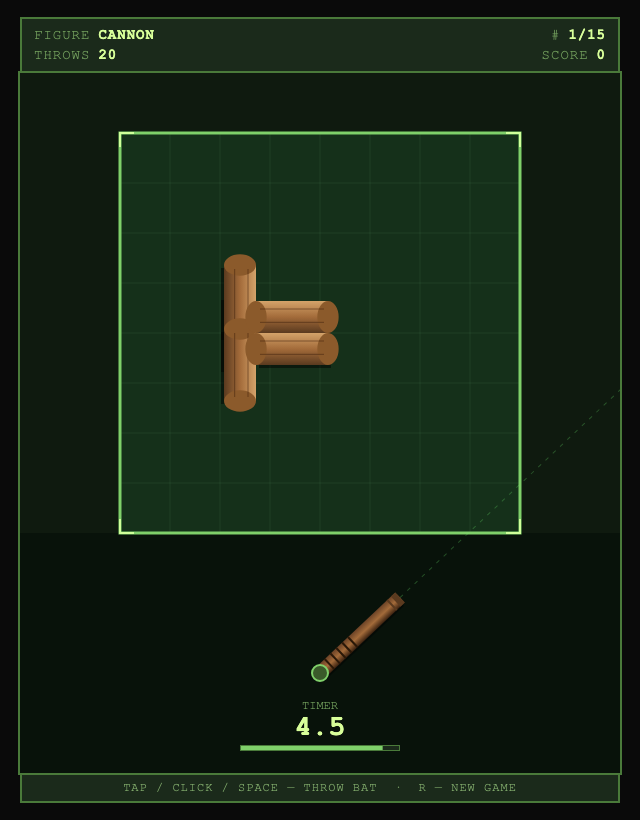

# Skittles

A web reimagining of **Gorodki** — the classic Soviet arcade game based on the
traditional Russian folk sport of the same name. Throw a swinging wooden bat
at formations of wooden pins ("skittles") and knock every piece out of the
square in as few throws as possible.

[**Play online →**](https://begoon.github.io/skittles)



## How to play

You see a square play area ("the city") at the top of the screen and a wooden
bat swinging back and forth at the bottom. Time your throw so the bat flies
into the pin formation and knocks every piece outside the square.

- **Tap / Click / Space** — throw the bat
- **R** — start a new game

You get **20 throws total** to clear all **15 figures**. Each throw has a
**5-second timer**; if you wait too long, the machine throws the bat for you
at a random angle (just like the original Soviet cabinet).

## The 15 figures

`CANNON` · `STAR` · `WELL` · `ARTILLERY` · `MACHINE GUN` · `SENTRIES` ·
`ARROW` · `SICKLE` · `RACKET` · `CRAYFISH` · `FORK` · `SHOOTING RANGE` ·
`AIRPLANE` · `LETTER` · `SEALED LETTER`

## Scoring

- **+50** for every figure cleared
- **+2** for every throw remaining at the moment of the clear

## Running locally

The game is a single self-contained HTML file with no build step and no
dependencies. Just open it:

```sh
git clone https://github.com/begoon/skittles.git
cd skittles
open index.html      # macOS
# or just double-click index.html
```

It runs entirely in the browser — Canvas 2D for rendering, Web Audio for
synthesized sound effects (throw whoosh, wood thunk, pin bump-out, clear
arpeggio, "ta-daa!" fanfare on game over). It works offline, on desktop,
and on mobile (touch input + responsive sizing).

## About the original

The Soviet arcade machine **Городки** (transliterated *Gorodki*, literally
*little towns*) was unique among Soviet coin-ops in that it wasn't a clone of
a Western title — it was a digital adaptation of a folk sport already familiar
to most Soviet citizens. The cabinet served as both entertainment and a
reflex/accuracy trainer.

You can see original gameplay footage here:
[full arcade playthrough on YouTube](https://www.youtube.com/watch?v=3YqXd-l8UjM).

## License

[MIT](LICENSE)
